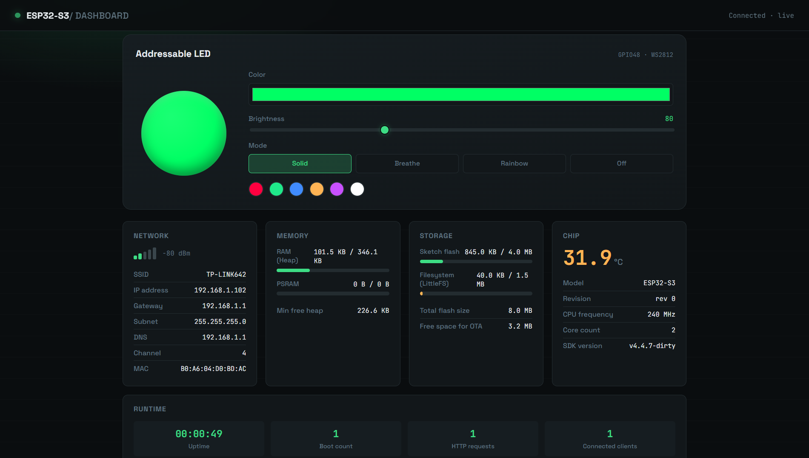

# ESP32-S3 Live Dashboard

A real-time web dashboard for the ESP32-S3 — live system metrics and
addressable LED control, pushed over WebSocket and served entirely from
onboard flash. No companion app, no cloud service, no external server.





## Why this exists

Most ESP32 "dashboard" examples either hardcode HTML into the firmware
(painful to iterate on) or poll the device every second over plain HTTP
(wasteful, and laggy for anything interactive like LED control). This
project keeps the frontend as ordinary, editable web files and uses a
persistent WebSocket connection so metrics update continuously and LED
changes apply instantly — across every connected client at once.

## Features

- **Live system metrics** — updates pushed every second over WebSocket, no polling
- **Addressable RGB LED control** (WS2812) — color changes apply instantly, synced across all connected clients
- **Web UI served from flash** — HTML/CSS/JS live on LittleFS, editable without touching firmware
- **Zero external dependencies** — no cloud relay, no companion app; everything runs on the device
- **mDNS support** — reachable at `esp32-dashboard.local`, no need to hunt for the IP

## Hardware

Built and tested on an **ESP32-S3 (N8R2 variant — 8MB flash / 2MB PSRAM)**.

| Requirement | Notes |
|---|---|
| Board | ESP32-S3, any variant with enough flash for LittleFS + firmware |
| LED | WS2812 / NeoPixel-compatible addressable RGB LED |
| Power | Stable 500mA+ USB supply (see [Troubleshooting](#troubleshooting)) |

## Project structure

```
esp32-dashboard/
├── platformio.ini          Board, framework, and library config
├── include/
│   ├── Config.h             All tunable settings (pins, WiFi, timing)
│   ├── LedController.h      RGB LED control (WS2812)
│   ├── SystemMetrics.h      Hardware/software metrics collection
│   └── JsonSerializer.h     Internal-data-to-JSON conversion
├── src/
│   ├── main.cpp             Entry point: WiFi, web server, WebSocket
│   ├── LedController.cpp
│   ├── SystemMetrics.cpp
│   └── JsonSerializer.cpp
└── data/                    Frontend files (uploaded to LittleFS)
    ├── index.html
    ├── style.css
    └── app.js
```

## Getting started

### 1. Install dependencies

This project uses [PlatformIO](https://platformio.org/). Install the
[PlatformIO IDE extension](https://platformio.org/install/ide?install=vscode)
for VS Code, or use the PlatformIO Core CLI directly.

### 2. Configure before uploading

**WiFi credentials**
In `include/Config.h`, replace `WIFI_SSID` and `WIFI_PASSWORD` with your
own network credentials.

**LED pin — keep `Config.h` and `LedController.cpp` in sync**
FastLED needs the pin number at **compile time** (a template parameter),
not at runtime. Because of that, the pin number exists in two places:

- `include/Config.h` → `Config::RGB_LED_PIN` (for reference/documentation)
- `src/LedController.cpp` → inside `FastLED.addLeds<WS2812B, 48, GRB>(...)`

If your board wires the LED to a different pin, update the `48` in
**both** files. This is one of the few real limitations of
template-based Arduino libraries — the compiler needs to know the pin
when it generates the templated code, so it can't be read from a config
struct at runtime.

> Not sure if your board's LED is RGB or single-color? Check the board's
> datasheet/schematic for "WS2812" or "NeoPixel" near GPIO38 or GPIO48.

### 3. Upload

This project has two parts, and **both** need to be uploaded:

```bash
# 1) Upload the filesystem (HTML/CSS/JS in data/) to the LittleFS partition
pio run --target uploadfs

# 2) Upload the firmware
pio run --target upload

# 3) Watch serial output (find the device IP, debug)
pio device monitor
```

Once connected, the IP address is printed to the serial monitor. You can
also reach the device via mDNS on the same WiFi network, without
knowing the IP:

```
http://esp32-dashboard.local
```

## Architecture

### Why LittleFS instead of PROGMEM?

There are two common ways to serve web files from an ESP32:

1. **PROGMEM** — HTML/CSS/JS content compiled as strings directly into the `.cpp` file
2. **LittleFS** (used here) — files stored on a separate flash partition and served at runtime

LittleFS was chosen because:

- Frontend files can be edited in any regular web editor, with real syntax highlighting
- Changing the dashboard's UI only needs `uploadfs`, with no firmware recompile/reupload
- Keeping C++ logic separate from HTML/CSS/JS (presentation) keeps the project cleaner

### Communication: HTTP for state, WebSocket for live updates

```
Browser  <---HTTP GET /api/status--->   Full snapshot (initial page load)
Browser  <======WebSocket /ws=======>   Live metrics every 1s + instant LED control
```

WebSocket was chosen over HTTP polling because:

- The connection stays open — no per-second TCP setup/teardown overhead
- An LED change from one client is pushed instantly to every other connected client

## Extending it

### Adding a new metric

To add a new field to the dashboard, update these four spots in order:

1. `SystemMetrics.h` → add the field to `struct Snapshot`
2. `SystemMetrics.cpp` → populate it in `capture()`
3. `JsonSerializer.cpp` → add a serialization line in `writeMetrics()`
4. `data/app.js` + `data/index.html` → add the display element and rendering

## Troubleshooting

| Issue | Likely fix |
|---|---|
| Page won't load / 404 | You forgot to run `uploadfs`; the `data/` files aren't on the device yet |
| LED color doesn't change but the UI updates | The pin in `LedController.cpp` doesn't match your board's actual pin |
| WebSocket keeps disconnecting/reconnecting | Weak USB power supply; the ESP32-S3 needs stable current under WiFi+WS load |
| Chip temperature reads oddly | Normal — the onboard sensor has low accuracy (±5-10°C), fine for spotting unusual heat, not a precise thermometer |

## Roadmap

- [ ] Persist LED state across reboots (currently resets on power loss)
- [ ] OTA firmware updates
- [ ] Authentication for the WebSocket endpoint

## License

MIT — see [LICENSE](LICENSE) for details.
